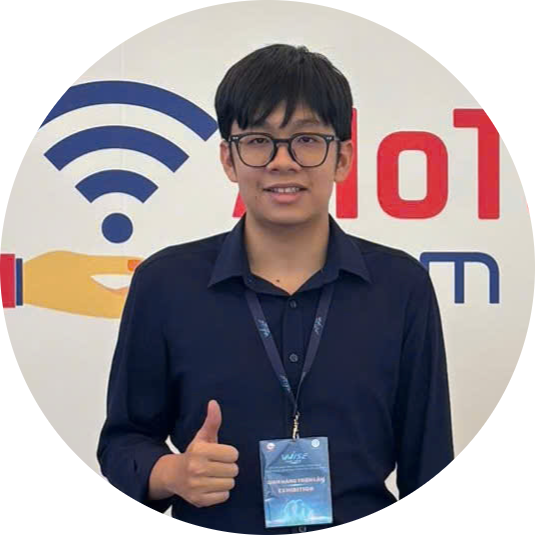
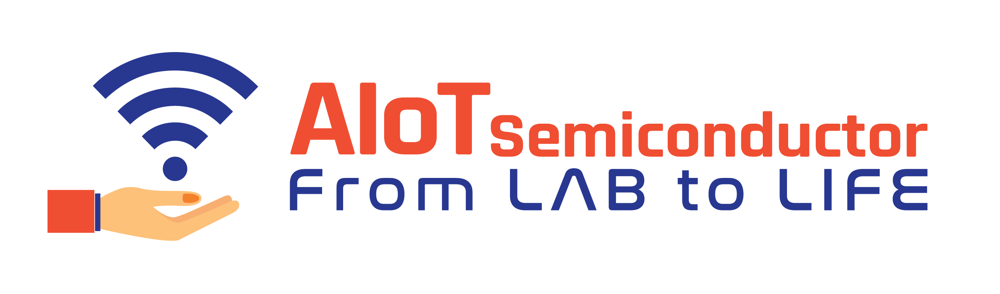

  <a href="https://github.com/HuuzNg312">
  

 

# Hi there, I'm Huu Nguyen 👋

### 🚀 Aspiring Full-stack Embedded IoT Engineer

 

&nbsp;&nbsp;&nbsp;

&nbsp;&nbsp;&nbsp;

---

### 👨‍💻 About Me

Hello! I am **Nguyen Phu Huu** (born in 2006).
 
I am currently a sophomore majoring in **Electronics and Telecommunications** at **[HCMUTE](https://hcmute.edu.vn/)** (Ho Chi Minh City University of Technology and Education).

Beyond the classroom, I am deeply involved in research and development at the **AIoT Semiconductor Lab** ("From LAB to LIFE").

 

  
   
  🌐 <i>Proudly contributing to <a href="https://iotvision.vn/" target="_blank"><b>iotvision.vn</b></a></i>

 

**🎯 My Technical Mission:**

My passion lies in the **Full IoT Stack**. I don't just want to write code; I want to build the entire system — from the silicon chip to the cloud dashboard.

* 🔭 **Focusing on:** High-performance Embedded Systems (STM32, ESP32) & RTOS.
* 🌱 **Learning:** Professional PCB Design & Cloud Connectivity.
* ⚡ **Fun fact:** I love turning caffeine ☕ into firmware 💾 and blinking LEDs 💡.

---

### 🛠️ Technology Stack

**💻 Programming Languages**
 

 

**🔌 Embedded & Hardware**
 

 

**☁️ IoT & Connectivity**
 

 

**⚙️ Tools & IDEs**
 

---

### 🚀 Featured Projects

<table>
  <tr>
    <td width="50%" valign="top">
      <h3>🤖 Autonomous Line Following & Obstacle Avoiding Robot</h3>
      

        <b>Capstone Project (Freshman Year)</b>
         
        A smart 2WD robot car capable of autonomously navigating complex tracks and avoiding obstacles in real-time.
         
        <i>(Dự án xe tự hành dò line & tránh vật cản sử dụng thuật toán điều hướng thông minh)</i>
      

       
      <b>🛠 Technical Highlights:</b>
      <ul>
        <li><b>Core:</b> Arduino Uno R3 + L293D Motor Shield.</li>
        <li><b>Sensors:</b> 3x TCRT5000 (Line Tracking) + HC-SR04 & SG90 Servo (Scanning).</li>
        <li><b>Power:</b> 2x 18650 Li-ion Batteries + LM2596.</li>
        <li><b>Algorithm:</b> PID-like logic & FSM (Finite State Machine).</li>
      </ul>
       
      

        
        &nbsp;
        
      

    </td>
    <td width="50%" align="center" valign="middle">
      

        
        &nbsp;
        
          
        
      

    </td>
  </tr>
</table>

 

---

### 📊 GitHub Stats

 

